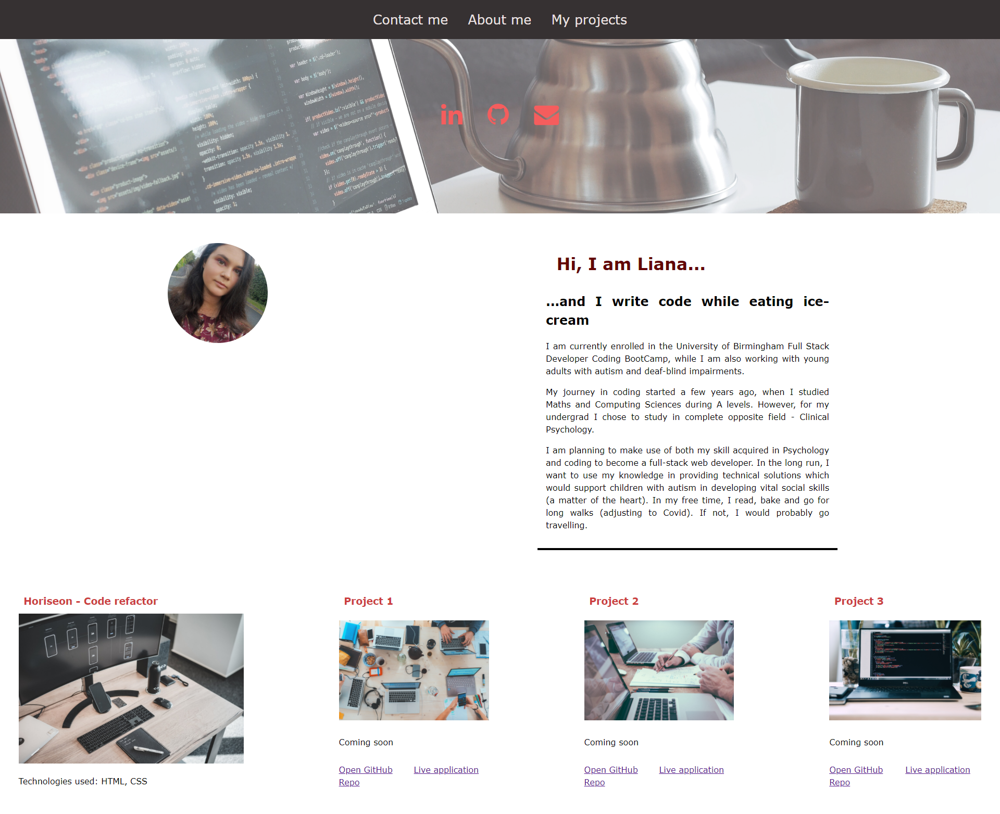
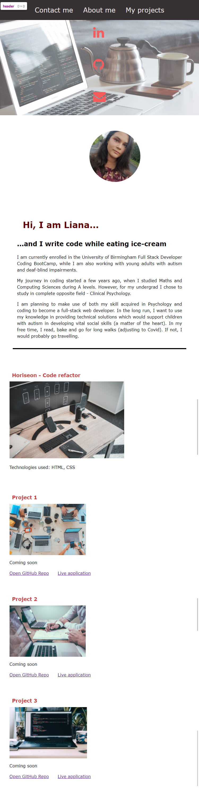
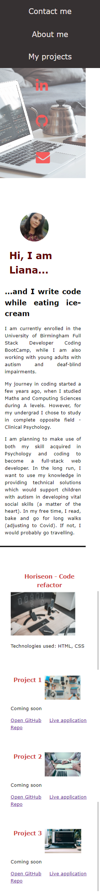

# My Portfolio - Liana Laurentiu

## Description

In this project I had to create my personal portfolio page and I was required to meet a series of specifications:

- my portfolio should include a given content structure
- to ensure my application is accessible on different screen sizes

## How I created my portfolio

### HTML Layout

- created a HTML layout with 3 main sections: about me, contact me and my projects
- added function links in the navigation bar which would scroll to main sections when clicked
- in about me section added my picture and a descriptive paragraph
- added hero image and social media icons which would take viewer to my contact pages when clicked
- added 4 project cards with images and descriptive title. First card image when clicked, it would take to deployed application.

### CSS layout

- used flexbox and media query to ensure the layout is responsive on different screen size (mobile, tablet and desktop)
- added external social media icons for my contact section
- used :first-child pseudo element to increase the size of the first project card
- applied :hover pseudo-element to change the color property for contact icons and add bottom borders for navigation links
- applied variable function to define and apply colors in my stylesheet, which would allow me to change color property just in the root elements and targeting more elements
-

## Screenshots deployed portfolio

### Desktop size

### Tablet size

### Mobile size

## Link deployed portfolio

Click [here](https://lianavaleria15.github.io/my_portfolio/) to see my deployed portfolio.
